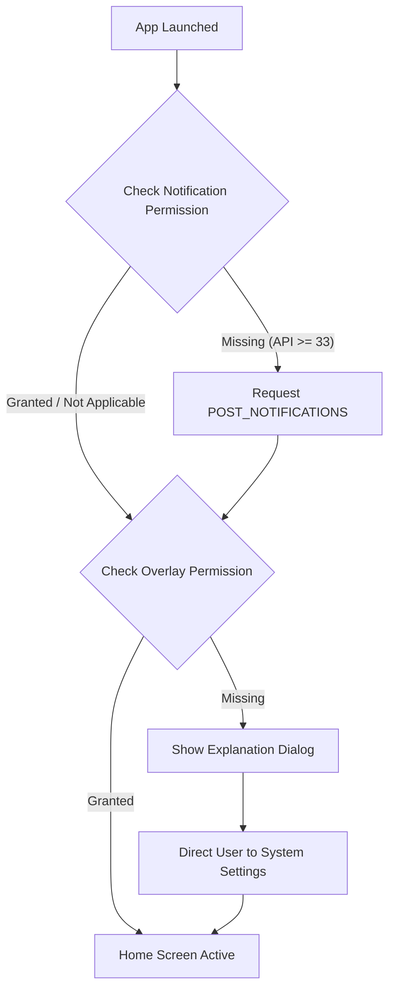

# Implementation Plan: Main Screen & Permission Management

This document outlines the implementation plan for building the Main Screen (Home Screen), managing Android permissions (System Overlay & Foreground Service), starting/stopping the background service, and cleaning up boilerplate generated code.

---

## 1. Objectives

1.  **Permission Request Flow**:
    *   On application launch, check and request all necessary permissions for displaying a full-screen overlay and running a foreground service.
    *   Permissions required:
        *   `android.permission.SYSTEM_ALERT_WINDOW` (to display the black overlay on top of all other windows).
        *   `android.permission.POST_NOTIFICATIONS` (required on Android 13+ to post persistent notification for the foreground service).
        *   `android.permission.FOREGROUND_SERVICE` and type-specific `android.permission.FOREGROUND_SERVICE_SPECIAL_USE` (required on Android 14+ for running a background service).
2.  **Home Screen UI**:
    *   Displays the App Name styled with `MaterialTheme.typography.headlineSmall`.
    *   Displays a Button to start/stop the application's `Foreground Service` (toggling service lifecycle).
3.  **Foreground Service (`BlackScreenService`)**:
    *   Manages the persistent notification and coordinates the overlay display state.
4.  **Boilerplate Clean-up**:
    *   Identify and remove unused boilerplate files generated by Android Studio (e.g., `DefaultDataRepository.kt`, greeting-related UI code).

---

## 2. Technical Design & Architecture

### Permission Handling Flow

Since `SYSTEM_ALERT_WINDOW` (Draw over other apps) cannot be requested via standard runtime dialogs, the app will execute the following logic when opened:



*   **Overlay Permission Check**: `Settings.canDrawOverlays(context)`
*   **Overlay Request**: Start activity with action `Settings.ACTION_MANAGE_OVERLAY_PERMISSION` and URI `package:${packageName}`.

### Foreground Service Lifecycle

*   **Service Name**: `com.doruruma.black_screen.service.BlackScreenService`
*   **Service Type**: `specialUse` (with manifest tag `<property android:name="android.app.PROPERTY_SPECIAL_USE_FGS_SUBTYPE" android:value="Black screen overlay utility to save battery and block distractions"/>`) or standard FGS permissions.
*   **State Tracking**: Use a simple binder or standard Kotlin `StateFlow` inside a companion object (or shared preference) to expose the running state of the service to the UI (`isServiceRunning: Flow<Boolean>`).

---

## 3. Proposed Changes

### Component 1: Permissions & Manifest Configuration

#### [MODIFY] [AndroidManifest.xml](file:///c:/Users/CODE.ID/Documents/private-works/black-screen/app/src/main/AndroidManifest.xml)
*   Add permissions:
    ```xml
    <uses-permission android:name="android.permission.SYSTEM_ALERT_WINDOW" />
    <uses-permission android:name="android.permission.FOREGROUND_SERVICE" />
    <uses-permission android:name="android.permission.FOREGROUND_SERVICE_SPECIAL_USE" />
    <uses-permission android:name="android.permission.POST_NOTIFICATIONS" />
    ```
*   Register `<service android:name=".service.BlackScreenService" android:foregroundServiceType="specialUse" android:exported="false" />` under `<application>`.

---

### Component 2: Service Layer (Foreground Service)

#### [NEW] [BlackScreenService.kt](file:///c:/Users/CODE.ID/Documents/private-works/black-screen/app/src/main/java/com/example/black_screen/service/BlackScreenService.kt)
*   Implements `android.app.Service`.
*   Displays a persistent notification using notification channels to keep the service alive.
*   Companion object exposes a reactive state flow of the service status (`val isRunning = MutableStateFlow(false)`).
*   Correctly handles `onStartCommand` to process start/stop intent actions.
*   Cleans up overlay windows on destroy.

---

### Component 3: UI Layer (Clean-up & Home Screen)

#### [DELETE] [DataRepository.kt](file:///c:/Users/CODE.ID/Documents/private-works/black-screen/app/src/main/java/com/example/black_screen/data/DataRepository.kt)
*   Remove unused repository template code.

#### [DELETE] [MainScreen.kt](file:///c:/Users/CODE.ID/Documents/private-works/black-screen/app/src/main/java/com/example/black_screen/ui/main/MainScreen.kt)
*   Remove greeting list views.

#### [DELETE] [MainScreenViewModel.kt](file:///c:/Users/CODE.ID/Documents/private-works/black-screen/app/src/main/java/com/example/black_screen/ui/main/MainScreenViewModel.kt)
*   Remove greeting view model.

#### [NEW] [HomeScreen.kt](file:///c:/Users/CODE.ID/Documents/private-works/black-screen/app/src/main/java/com/example/black_screen/ui/home/HomeScreen.kt)
*   Displays:
    *   Headline: "Black Screen" with `MaterialTheme.typography.headlineSmall`.
    *   Description: Brief instruction about how the overlay works.
    *   Tonal/Filled Button: Starts/stops the foreground service based on active state.
*   Request runtime permissions on launch:
    *   Prompt for notification permissions.
    *   Prompt for overlay drawing permissions if missing.

#### [NEW] [HomeScreenViewModel.kt](file:///c:/Users/CODE.ID/Documents/private-works/black-screen/app/src/main/java/com/example/black_screen/ui/home/HomeScreenViewModel.kt)
*   Manages permissions status check.
*   Listens to `BlackScreenService.isRunning` state flow and provides reactive UI state.

#### [MODIFY] [Navigation.kt](file:///c:/Users/CODE.ID/Documents/private-works/black-screen/app/src/main/java/com/example/black_screen/Navigation.kt)
*   Refactor navigation destination to load `HomeScreen` instead of the old `MainScreen`.

---

## 4. Verification Plan

### Automated Tests
*   **Unit Tests (`HomeScreenViewModelTest.kt`)**: Verify that the UI state correctly maps to the service state.
*   **Service Lifecycle Verification**: Assert that starting/stopping commands trigger correct states in the companion object Flow.

### Manual Verification
*   **Permission Dialog Checks**: Install the app on Android 13+ or 14+; verify that:
    1.  The notification permission dialog displays instantly.
    2.  The overlay dialog appears and successfully redirects the user to settings.
*   **Service Toggling**: Clicking "Start Service" displays a persistent notification. Clicking "Stop Service" removes the notification.
